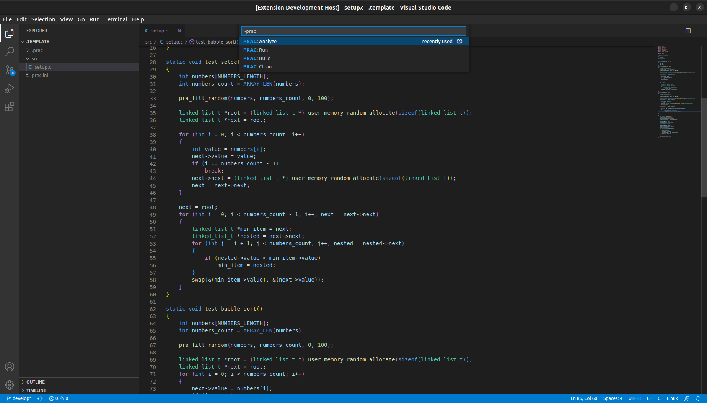
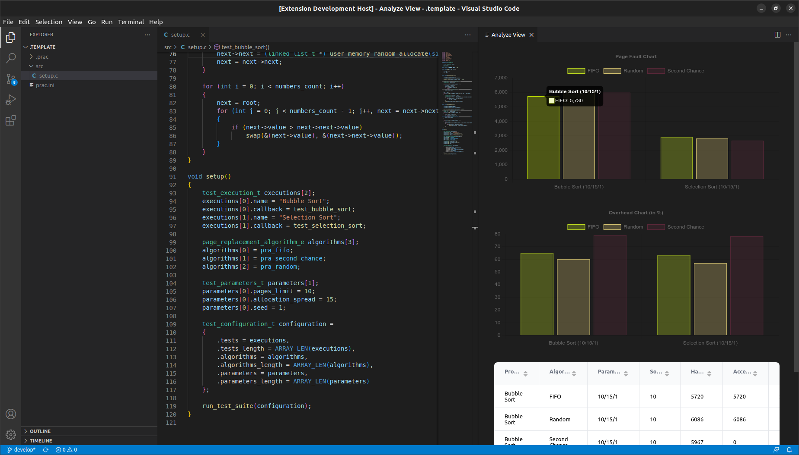

# User Manual

This is a C framework for comparing page replacement algorithms on x86 architecture by using test suites. Testing such algoritms on a running operating system would be inaccurate, because the results would be influenced by many parts of a operating system. Therefore this framework runs on a bare machine by implementing a bootloader and a custom kernel for running test suites and page replacement algorithms.

## Dependencies

Since this project compiles C code for specific architecture one of the dependencies is a GCC cross-compiler. For ease-of-use, you can use our [CLI tool](https://github.com/vbieleny/prac-cli) to download and install a supported GCC toolchain.

Once you have installed the CLI tool, you can run this command to automatically download this framework and the GCC toolchain.

```shell
prac init
```

Other dependencies include NASM for assembling bootloader source code and other assembly files. For creating final bootable ISO file, you're gonna need a `mkisofs` tool. Finally, to execute the code you will need a QEMU for i386.

To install these dependencies on Ubuntu, execude this commands:

```shell
sudo apt update
sudo apt install build-essential nasm mkisofs qemu-system-i386
```

Optional dependencies for running framework tests are 32-bit GCC, which can be installed by executing this command for Ubuntu based systems:

```shell
sudo apt install gcc-multilib
```

## Usage

The standard usage of this framework consists of these steps:

1. Create a new project
2. Write custom test programs and test suite
3. Write custom page replacement algorithms (optional)
4. Execute the project to see results of comparison
5. Analyze and display the results graphically via the [VS Code extension](https://github.com/vbieleny/prac-extension)

### Creating a new project

To create a new project, just run

```shell
prac create
```

This will initialize a new project in your current working directory.

### Writing test programs and test suite

After creating a new project, your project directory structure will look like this.

- `.prac/` – build folder, that contains framework sources and compiled files or analysis results
- `src/` – source folder where your sources will go (test programs, test suites or page replacement algorithms)
- `prac.int` – configuration file with framework options

To make creating test programs easier, there will be already a sample implementation of a test suite with two test programs.

Creating a test program is easy. It is just a function with no arguments and no return value that implements all the code you want to test (i.e. a sorting algorithm).

To run such a test program, we also need to define a test suite. This is done by creating a `test_configuration_t` structure that contains which test programs are to be executed, what parameters to use and which page replacement algoritms to use.

After creating such configuration, you can execute it by calling `run_test_suite(configuration);`

A very simple example of configuration definition si shown below.

```c
void setup()
{
    test_execution_t execution =
    {
        .name = "Bubble Sort",
        .callback = test_bubble_sort
    };
    page_replacement_algorithm_e algorithm = pra_fifo;
    test_parameters_t parameters =
    {
        .pages_limit = 10,
        .allocation_spread = 15,
        .seed = 1
    };
    test_configuration_t configuration =
    {
        .tests = &execution,
        .tests_length = 1,
        .algorithms = &algorithm,
        .algorithms_length = 1,
        .parameters = &parameters,
        .parameters_length = 1
    };

    run_test_suite(configuration);
}
```

To use an "allocation spread" parameter in your test programs, use `void* user_memory_random_allocate(size_t size)` function to allocate your memory randomly in selected allocation spread.

### Writing a page replacement algorithm

This framework already implements some page replacement algorithms that you can use. You can find a list of these algoritms in [API reference](https://vbieleny.github.io/page-algorithm-comparison/pra__pfh_8h.html#a1b5e8e701f1a8b607fc9c380c391b4cb). To write a new page replacement algorithms, you need to create and implement a function that will handle page faults. 

This function signature is defined like this:

```c
typedef void (*page_replacement_function_t)(uint32_t error_code, page_fault_handler_result_t *result);
```

First parameter `error_code` is an error code specified by system when generating a page fault exception. You can read more about the structure of this error code [here](https://wiki.osdev.org/Exceptions#Page_Fault).

Second parameter `result` is a pointer to a structure that will be used to aggregate statistical information about your page replacement algorithm. To get accurate results, you must use correctly fill the result structure when necessary. To ease filling this structure with all the information manually, you can use `page_fault_handler_result_fill` function to fill the results automatically by supplying the victim `page_table_entry_t` as a parameter.

There are two other optional functions that you can implement. Those are `page_replacement_init_function_t` and `page_replacement_destroy_function_t` functions. Initialization function will be called before each test program is executed. You can use this function to initialize variables that are needed for page fault handler algorithm. Destroy function is called after each test program execution is finished and must destroy all initalized data to provide accurate results.

You can see an implementation of Random page replacement algorithm [here](https://github.com/vbieleny/page-algorithm-comparison/blob/develop/src/pra_pfh_random.c).

### Executing a project

Executing a project is as simple as using a CLI tool. You can also build or clean your project with `prac clean` and `prac build` commands. To execute a project, just run this command in current project

```c
prac run
```

This will build your project, execute the test suite you specified and display a results. If you want to see better comparison of these results, we recommend you use a VS Code extension and it's provided functionality.

## Using a VS Code extension

The recommended usage of this framework is with a VS Code extension that supports editing, building and analyzing your projects. To download and install the extension, follow these [instructions](https://github.com/vbieleny/prac-extension).

When you have successfully installed the extension and have a existing project, you can open the folder in VS Code and the extension will be automatically activated. All commands that you can run use `PRAC` prefix. You can build, clean, run on analyze your project by running these commands from your command palette.



The main benefit of this extension comes from ability to analyze the results of the test suite. To analyze your project, just execute the command `PRAC: Analyze`, which will build your project, execute it and parse the results to show in charts and tables.



# Tests

To run framework tests, you can execute `make test`, which will execude all tests in the `test` folder and display the results.

> :warning: If you are on a x64_86 machine, you need to first install 32-bit GCC version

# API Reference

For more technical documentation and implementation details, check out the [API reference](https://vbieleny.github.io/page-algorithm-comparison/files.html).

# License
Distributed under the MIT License. See LICENSE.txt for more information.
